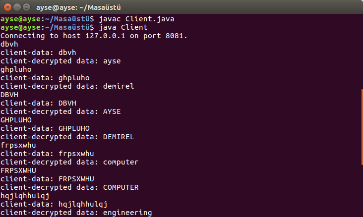
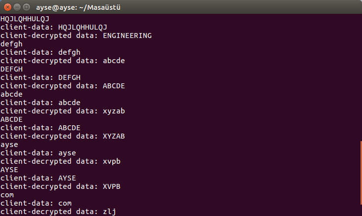
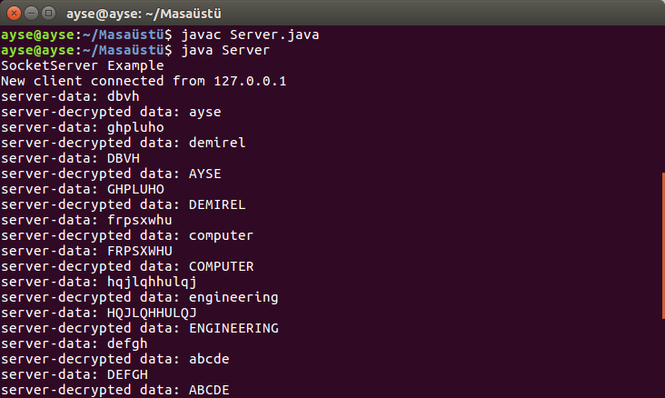
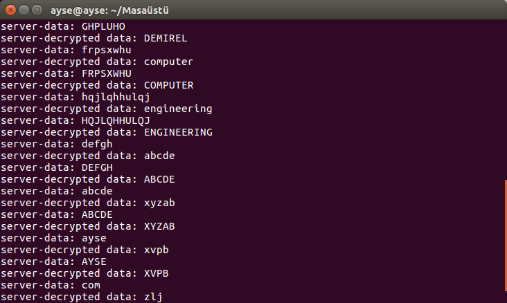
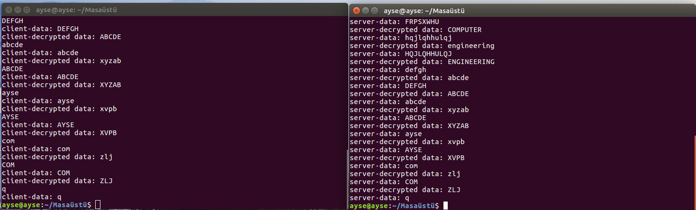

## SUMMARY
The project is a client-server system. The message from the client to the server is encrypted. The server-side receives the encrypted message and decrypting it with the *Ceaser Cipher* method. If you don't know what is *Ceaser Cipher* method check the [link](https://www.geeksforgeeks.org/caesar-cipher-in-cryptography/).

## ATTENTION
If you are working on your computer only, you can run it with "127.0.0.1". If you want to run the client and the server on a separate computer, you should arrange the IP and check the port information.

## RUN
If you run the project on an IDE, first run the client, then run the server. You will see the connection messages if the server-client is connected correctly. 
If you run the project on the command line, the commands what you need are below:
**Server: **``javac Server.java`` (to compile)
              ``java Server`` (to run)
**Client:** ``javac Client.java`` (to compile)
              `` java Client`` (to run)

## METHOD
Unlike the common Ceasar cipher method, in the project shift left 3 times was used. 

- Get a string message
- Parse it to char array
- Get the char order by order in a loop
- Check the char is in [A-Z] or [a-z] or not letter
- If it is in [A-Za-z], apply minus 3 (shift left 3 times) 
- If it is not a letter, add the character number (26), so it will be a letter
- If the resulting char is not a letter after the operations: make it a letter again with shifting operations.

## SCREENSHOTS

**Client :**

**Server:**

**Server and Client:**

